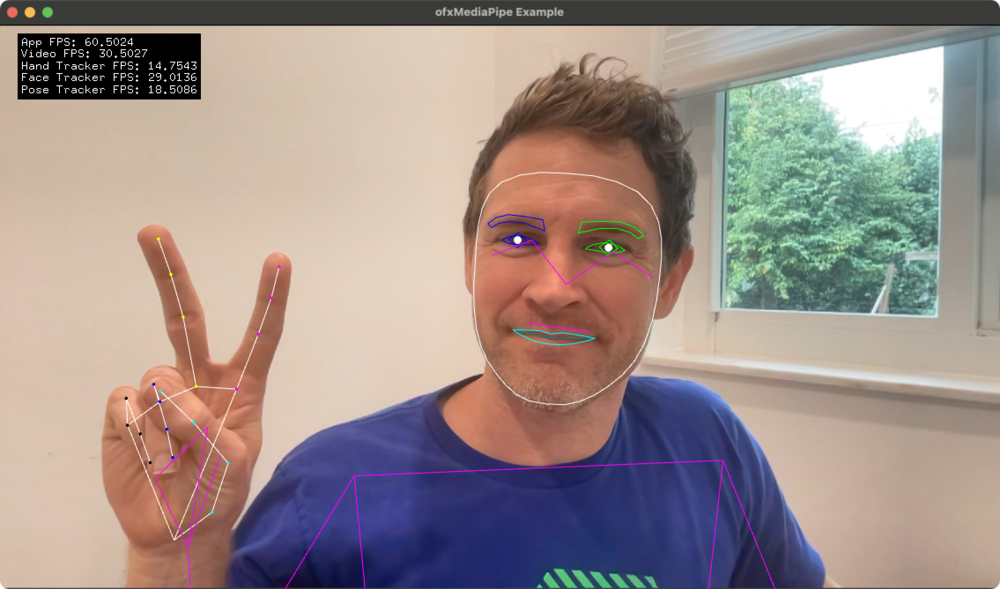
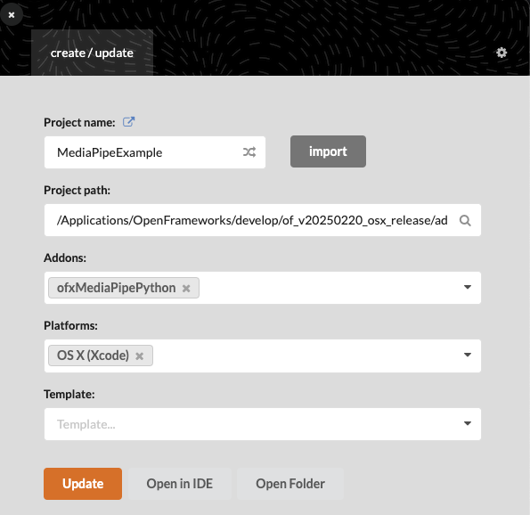
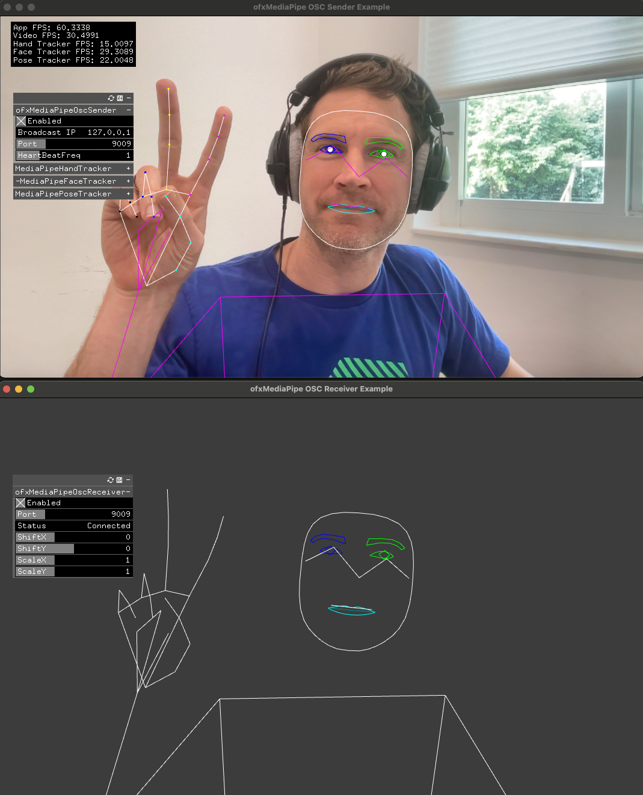
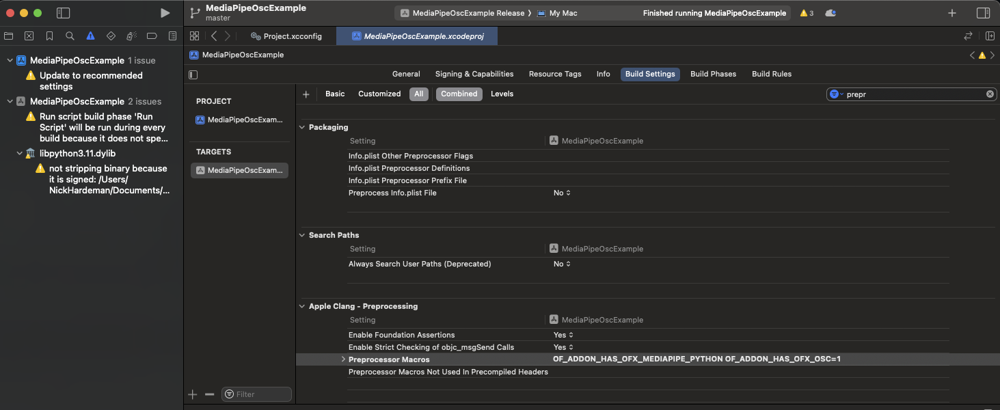

# ofxMediaPipePython
Addon for running python version of MediaPipe within an OpenFrameworks application using pybind.

## Tracking
### Faces: https://ai.google.dev/edge/mediapipe/solutions/vision/face_landmarker/python
### Hands: https://ai.google.dev/edge/mediapipe/solutions/vision/hand_landmarker/python
### Poses: https://ai.google.dev/edge/mediapipe/solutions/vision/pose_landmarker/python

## Platforms
Supported on macOS and Linux using OpenFrameworks >= 12.0.

An install script has been provided to help with installation of Media Pipe. 
The script will download miniconda, create a conda environment named 'mediapipe' and install mediapipe using pip.

To install: 

`cd to ofxMediaPipePython`

`./InstallMediaPipe.sh`

Build the example projects using the Project Generator. 

# OSC Sending and Receiving

Compiling and running the OSC sender and receiver examples require the Preprocessor macro `OF_ADDON_HAS_OFX_OSC`

## XCode:
Navigate to the Xcode project settings / Build Settings / Preprocessor Macros and add `OF_ADDON_HAS_OFX_OSC=1`

## Linux:
Add `OF_ADDON_HAS_OFX_OSC` to the project config file, for example: MediaPipeOscReceiverExample / config.make

Adjust it to the following ( removing the # sign )

`PROJECT_DEFINES = OF_ADDON_HAS_OFX_OSC`

